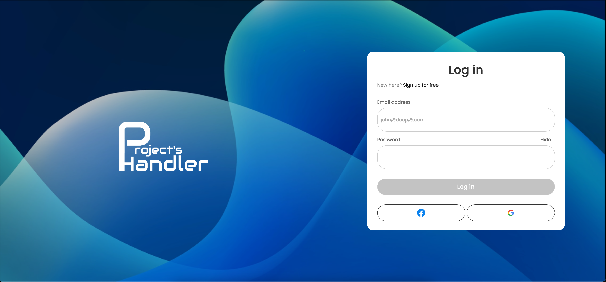
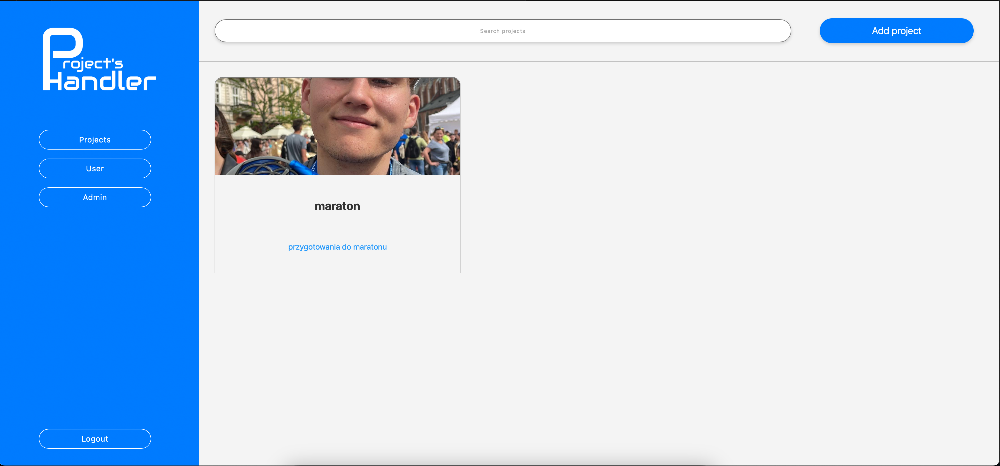
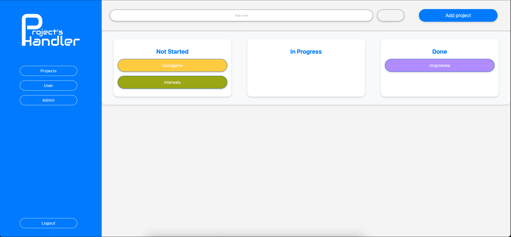

# Project Handler

## Overview

This project is a web-based application for managing projects and tasks. It allows users to create, edit, and delete projects and tasks, and organize tasks using a Scrum board.

## Features

- **User Authentication**: Secure login and registration system.
- **Project Management**: Create, view, edit, and delete projects.
- **Task Management**: Add, update, and delete tasks within projects.
- **Scrum Board**: Organize tasks into columns (Not Started, In Progress, Done) and drag-and-drop tasks between columns.
- **Context Menu**: Right-click context menu for editing and deleting projects and tasks.

## Installation

1. **Clone the repository**:
    ```bash
    git clone https://github.com/balicz3k/ProjectsHandler.git
    cd ProjectsHandler
    ```

2. **Install dependencies**:
    - Ensure you have PHP and Composer installed.
    - Run the following command to install PHP dependencies:
        ```bash
        docker compose up --build -d
        ```

3. **Set up the database**:
    - Create a PostgreSQL database.
    - Import the database schema from `database/schema.sql`.

4. **Configure the application**:
    - Copy the `.env.example` file to `.env` and update the database credentials and other configuration settings.

5. **Access the application**:
    - Open your web browser and navigate to `http://localhost:8000`.

## Screenshots

### Login Page


### Projects Page


### Scrum Board


## Project Structure

- `public/`: Publicly accessible files (CSS, JavaScript, images).
- `src/`: PHP source code (controllers, models, repositories).
- `views/`: HTML templates for rendering views.

## Functionality

### User Authentication

- **Login**: Users can log in with their credentials.
- **Registration**: New users can register for an account.

### Project Management

- **Create Project**: Users can create new projects with a title, description, and image.
- **View Projects**: Users can view a list of their projects.
- **Edit Project**: Users can edit the title and description of their projects.
- **Delete Project**: Users can delete projects.

### Task Management

- **Add Task**: Users can add tasks to a project with a title and color.
- **Update Task**: Users can update the title and color of tasks.
- **Delete Task**: Users can delete tasks.

### Scrum Board

- **Organize Tasks**: Tasks are organized into columns (Not Started, In Progress, Done).
- **Drag-and-Drop**: Users can drag and drop tasks between columns to update their status.

## License

This project is licensed under the MIT License. See the [LICENSE](LICENSE) file for details.